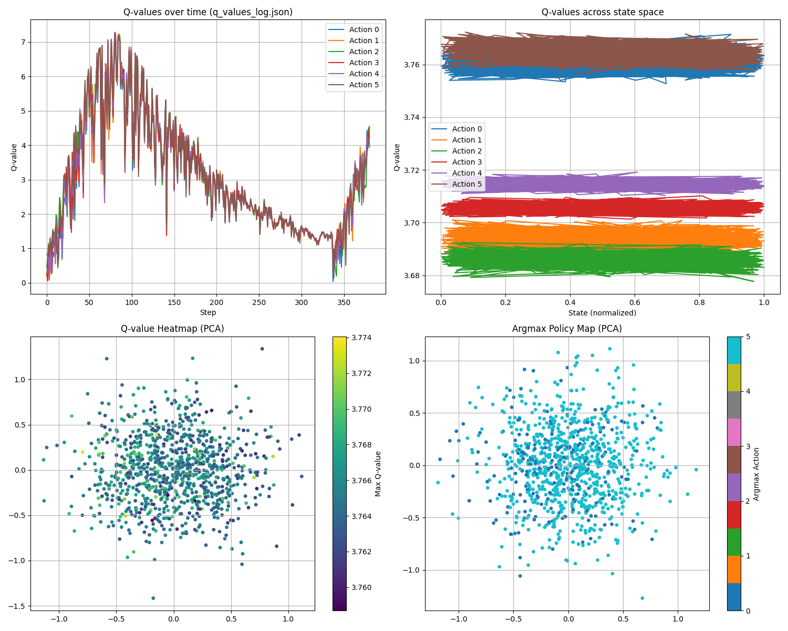
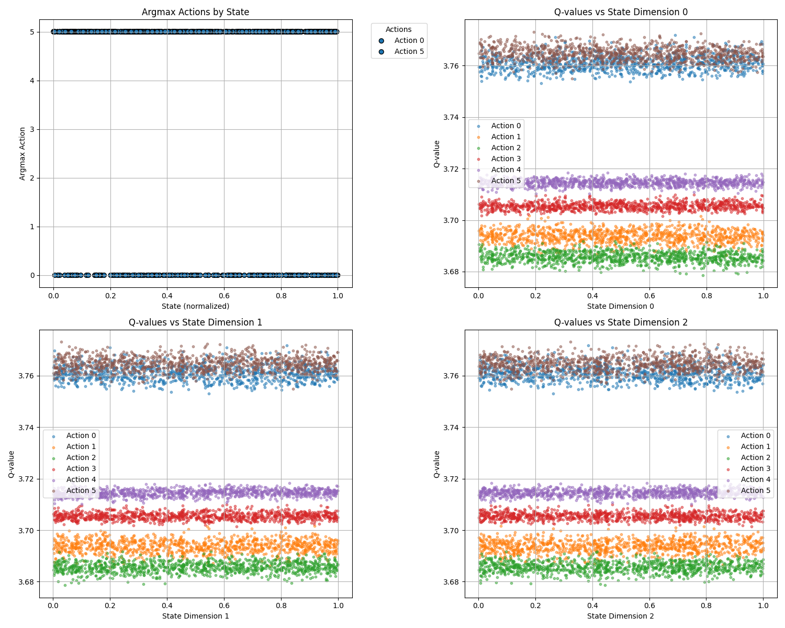
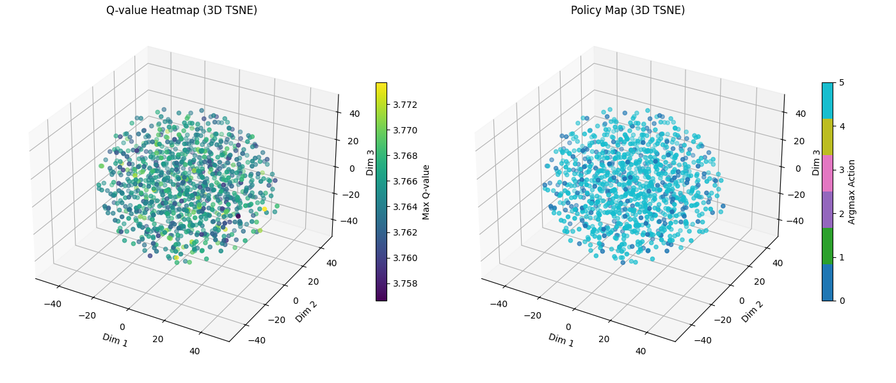
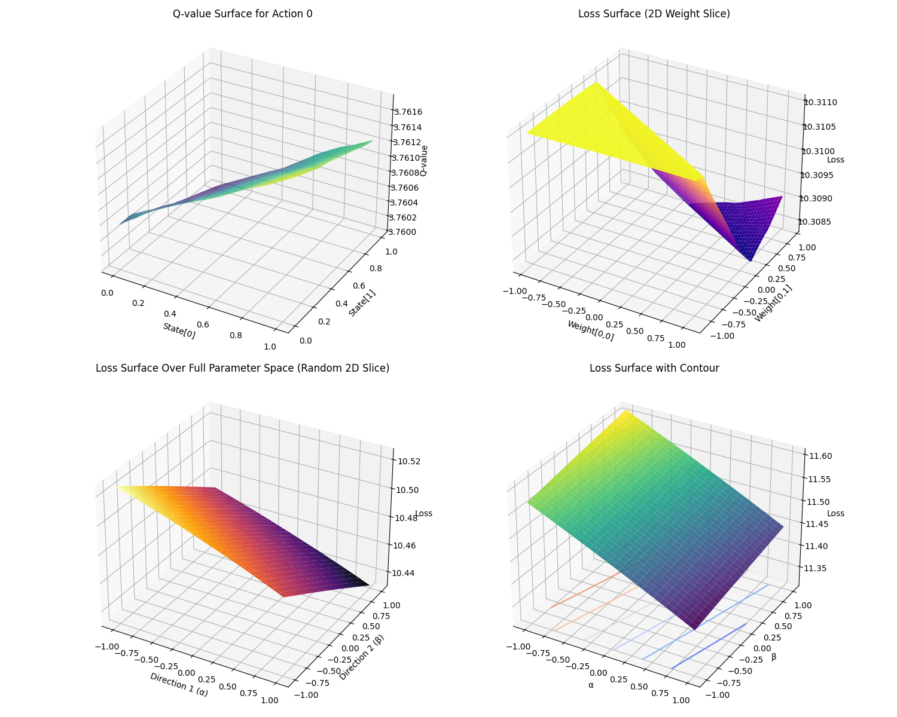
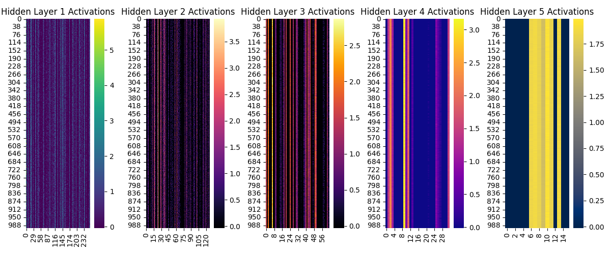

# Pygame_refacored_AI
Make Simple Pygame like Maiple Story Type.

A simple AI test consisting of a typical DQN with five hidden layers using leaky_relu, 91-dimensional states, and 6 actions.
The system is still under testing and is being updated continuously.

- files -
Train.py is used to train the AI, while the game itself can be played manually using Pygame_refactored.py.
visualize displays the current state through various graphical plots.
logdata.py calculates and displays item drop probabilities based on the law of large numbers.
game_env.py enables the game to be controlled by the AI and provides rewards and states.
agent.py defines the AI using PyTorch and handles functions such as remember, replay, and step.
Train.py runs the training per episode and is used for adjusting epsilon.

 Pygame_refactored.py.
how can play the game. 
if u kill all monster then you can find portal

MOVE  : arrow left:<--  right:-->
JUMP  : Left_ALT 
ATTACK : Left_Ctrl  

if you get skill item. then use skill
Number KEY : 1~5
Quest Key : Q

When all the monsters on the screen are defeated, a portal appears. Entering the portal takes you to the next stage.
Monsters move randomly and become faster over time.
On stage 9, a boss monster appears.
Until then, collect items and experience to grow stronger and prepare for the boss battle.

v 0.30
Refined and added states, integrated RewardNet, adjusted reward logic, and fixed bugs."

v 0.50
Used DualReplayAgent as a solution to handle delayed rewards for character actions.
Employed a DuelingDQNModel with three hidden layers and two dueling layers, using the SiLU activation function.
Implemented goal separation for more structured training.
Introduced RewardNet, also with three hidden layers, to infer delayed or indirect rewards.
Separated the implementations of the model, agent, and PrioritizedReplayBuffer for modularity and maintainability.
Utilized a dedicated set of goal_indices for training RewardNet based on state changes. 
and fixed bugs

v 0.55
"We apply an LSTM-based DQN using a state trajectory buffer.
Long-term goals are separated and handled with a dedicated Dueling architecture over 8 distinct states.
For short-term rewards, we use RewardedNet with prioritized experience replay.
Actions related to long-term goals are selected via the LSTM-based DQN.
Random actions are taken with a 10% probability."