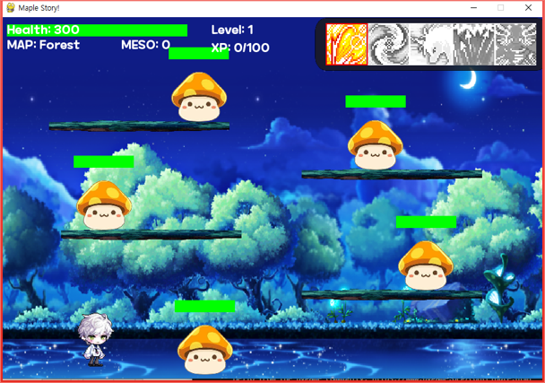

# Pygame_refacored_AI
Make Simple Pygame like Maiple Story Type.

A simple AI test consisting of a typical DQN with five hidden layers using leaky_relu, 91-dimensional states, and 6 actions.
The system is still under testing and is being updated continuously.

- files -
Train.py is used to train the AI, while the game itself can be played manually using Pygame_refactored.py.
visualize displays the current state through various graphical plots.
logdata.py calculates and displays item drop probabilities based on the law of large numbers.
game_env.py enables the game to be controlled by the AI and provides rewards and states.
agent.py defines the AI using PyTorch and handles functions such as remember, replay, and step.
Train.py runs the training per episode and is used for adjusting epsilon.
